# Bài toán 1: Nên quăng cái gì!

Thân chào cả nhà, hôm nay mình có một tình huống (problem). Mong cả nhà giúp sức. "Chả là năm 1931, Piccard và Paul Kipfer dùng kinh khí cầu để bay cao đến 15781m, nơi mà áp suất bằng 1/10 áp suất ở mực nước biển. Để có thể bay cao hơn thì cần làm nhẹ kinh khí cầu bằng cách vứt bỏ những thứ không cần thiết. Tuy nhiên những thứ không cần thiết đó nếu rơi từ độ cao đó xuống bề mặt trái đất thì thật sự không an toàn cho con người. Hỏi phải làm sao?

 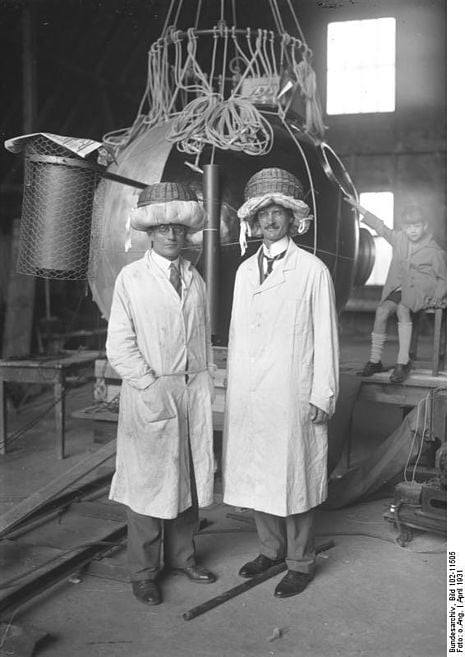

# Bài toán 2: Thụ phấn cho hoa!

Hôm nay là câu chuyện của bác nông dân. Chuyện là thế này:
Từ xưa đến nay, việc thụ phấn cho hoa là do các loại côn trùng như loài ong, bướm và các loại con trùng khác. Tuy nhiên, việc làm dụng thuốc trừ sâu, săn bắt đã làm các loài côn trùng tránh xa các cánh đồng. Như vậy, năng suất của mùa vụ ngày càng đi xuống.

Đứng trước hoàn cảnh đó, một vài người đã dùng gió để chuyển phấn hoa thay cho loài côn trùng. Sau một mùa thử nghiệm, họ cũng nhận thấy năng suất không cải thiện là bao. Bởi vì khi gió thổi mạnh để đưa phấn hoa đến nhuỵ hoa thì các cánh hoa tự động khép lại như một phản xạ tự nhiên để bảo vệ nhuỵ hoa, các loài cây chỉ “nghĩ” rằng khi có gió mạnh là sắp có thời tiết xấu, nên chúng tự bảo vệ bằng cách khép cánh hoa lại.

Hỏi phải làm gì để thụ phấn cho cây? Hay các cánh hoa vẫn phải mở khi gió thổi!
 
 

# Bài toán 3: Loài kiến. 

Loài kiến là những công nhân môi trường cho rừng rậm. Chúng ăn các loài con trùng, sâu nhỏ... Thỉnh thoảng, chúng hạnh phúc khi tìm được một con sâu lớn và nặng. Đây chính là vấn đề, chúng không thể nâng một con sâu khủng như vậy được. Thật là tệ khi bỏ lại món ăn này. Nếu xẻ ra để mang đi thì tốn quá nhiều thời gian. Hỏi phải làm gì?

 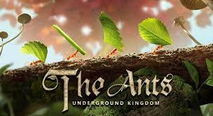

# Bài toán 4:Chú voi thông minh nhất thế giới?

Vào cuối thế kỷ trước, một đoàn xiếc thu hút rất nhiều bạn nhỏ trên khắp thế giới. Bởi vì có một con voi rất thông minh biểu diễn. Nó có thể đếm, cộng, trừ, nhân và chia trong phạm vi 20. Trên màn hình sân khấu, có cái bảng lớn, các con số từ 1 đến 20 được viết rõ ràng trên bảng, tương ứng vào mỗi ô. Chú voi dùng chiếc vòi giữ thanh kim loại để chỉ, và chỉ ra câu trả lời sau khi khán giả yêu cầu. Hỏi đoàn xiếc và ông chủ đã làm gì?

 
 
 
 
# Bài toán 5: Vụ mùa khoai tây!

Vào mùa xuân, những người nông dân đang chuẩn bị trồng khoai tây. Nhưng trên cánh đồng từ năm ngoái đã ẩn nấp một loại sâu bệnh trong kén. Chúng có thể đợi hơn một năm. Khi chúng ngửi thấy mùi khoai tây, chúng sẽ chui ra ngoài và tìm đến thức ăn - khoai tây. Trước mùa vụ, các cánh đồng được xới bằng hóa chất, nhưng sâu bệnh vẫn không tiêu diệt hết. Bên cạnh đó, hoá chất cũng khuyến cáo không nên quá lạm dụng. Những gì có thể được thực hiện?

 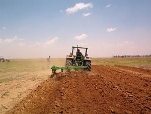

# Bài toán 6: Thám tử tài ba!

Một công ty đặt mua dầu hướng dương. Người ta vận chuyển dầu tới công ty bằng xe bồn. Mỗi một xe bồn có dung tích tải là 10000 lit. Khách hàng đột nhiên phát hiện ra mỗi lần xe bồn xả dầu đều có một lượng 40 lít dầu bị thiếu hụt. Người khách hàng kiểm tra thiết bị đo đạc và thấy mọi thứ đều ổn. Ông ta kiểm tra khóa ở nắp trên và kiểm tra xem dầu liệu có bị rò rỉ không, nhưng không phát hiện được gì. Ông ấy cũng xét tới cả lớp mỏng dầu còn lại ở phía trong xe bồn, cũng như nhiệt độ của dầu. Không yếu tố nào có thể tính cho phần bị hao hụt. Một vài thám tử được mời điều tra nhưng họ không tìm thấy gì cả. Chiếc xe tải chưa bao giờ dừng trong suốt quá trình vận chuyển và tài xế chưa bao giờ rót dầu ra khỏi bồn. Vậy tại sao dầu lại bị thiếu hụt?

 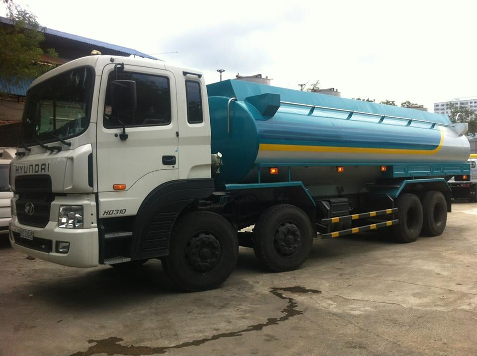

# Bài toán 7: Nhà vua “khó tính”

Chuyện kể về vị vua Portos, người rất cầu kỳ trong việc ăn mặc. Một hôm, lính ngự lâm đưa tới một thợ may có tiếng Moliere để may một bộ y phục mới. Moliere chuẩn bị thước để lấy số đo cho nhà vua. Tuy nhiên, nhà Vua hét lớn “ Đừng chạm vào tôi!”. Hỏi người thợ may phải làm gì?, tuyệt đối không được từ chối may y phục cho nhà vua, nếu không thì mất mạng. (Trích từ câu chuyện Alexander Dumas).
 
  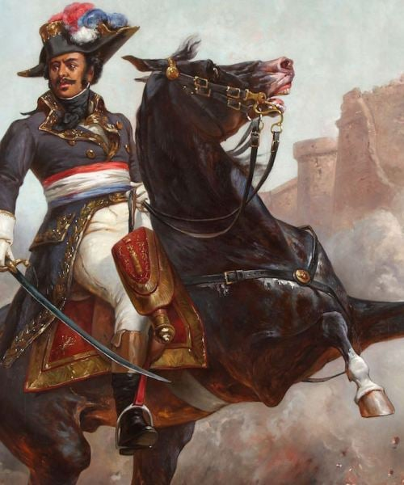

# Bài toán 8: Bức chân dung xấu xí “đắt đỏ”

Một viên chức ngân hàng già và xấu đặt mua chân dung của chính mình cho một hoạ sĩ trẻ. Người hoạ sĩ phải đối mặt với một tình huống khó xử: 

- Nếu anh ta vẽ viên chức ngân hàng như thể bây giờ (già và xấu), viên chức sẽ tức giận và từ chối trả tiền. 

-Và nếu họa sĩ vẽ chân dung, thì viên chức sẽ không tìm thấy điểm tương đồng nào và một lần nữa, sẽ từ chối thanh toán. 
Không thể vẽ trẻ trung và chân thực, họa sĩ đã khắc hoạ viên chức ngân hàng già và xấu. " Đó không phải tôi!" – viên chức thốt lên và bỏ đi, tất nhiên là đóng sầm cửa lại và không trả gì cả.

Người hoạ sĩ nhún vai, cười khà khà, nói: "Không sao đâu, ông ta phải trở lại thôi. "Thật vậy, vài ngày sau, viên chức ngân hàng xuất hiện trở lại trong xưởng vẽ của họa sĩ và mua bức chân dung của ông, mặc dù bây giờ giá bức chân dung tăng gấp mười lần. Anh hoạ sĩ đã làm gì?

 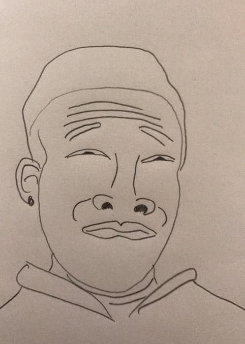

# Bài toán 9: Nhiệt độ cơ thể của con mọt gạo.

Vào đầu năm 1985, các nhà khoa học cùng nhau thảo luận về con mọt gạo. Họ nhận thấy điều kiện sống của những con bọ cánh cứng này được nghiên cứu rất ít. Không ai biết “ Thân nhiệt” của một con bọ này bao nhiêu.

Hãy giúp các nhà khoa học! Bạn có thể sử dụng nhiệt kế thông thường, cái ly, mọt gạo và nên nhớ tiết kiệm chi phí khi thực hiện đo lường.

   

  
# Bài toán 10: Trò lừa thế kỷ.

Một trong những bảo tàng ở Đức đã mua bức tranh của danh hoạ Peter Paul Rubens từ một trong những bảo tàng ở Pháp. Các chuyên gia Đức kiểm tra bức tranh ngay tại chỗ, và công nhận bức tranh là hàng thật, và các chuyên gia đã xác nhận bằng chữ ký ở mặt sau bức tranh. Sau đó bức tranh được đóng gói và gửi sang Đức. Khi đến bảo tàng ở Đức, họ tiến hành kiểm tra lần thứ hai và phát hiện ra rằng đó là tranh giả. Nhưng thật kỳ lạ, có chữ ký chuyên gia ở mặt sau của đồ bức tranh giả và các chữ ký chính là của chuyên gia.

 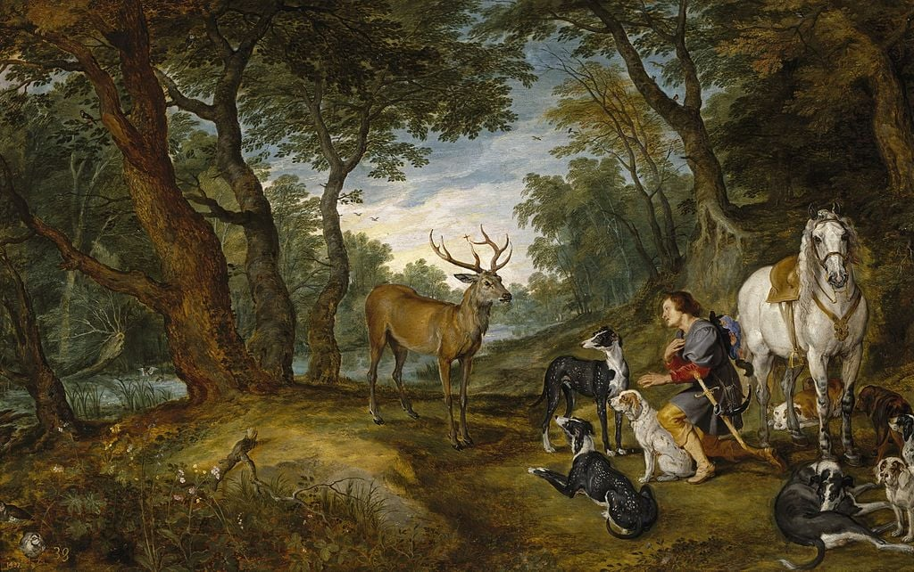

Bạn có đoán “ trò lừa thế kỷ” thực hiện như thế nào không? 

# Bài tập 11:  Ngăn chặn sốt rét!

Nhà khoa học - bác sĩ L.M. Isaev trong thế kỷ trước đã kiên cường chiến đấu chống lại loài muỗi truyền bệnh sốt rét. Ông đã tìm ra rằng những con muỗi như vậy được sinh ra trong các hồ nhỏ. Khi ấu trùng chưa trở thành muỗi, việc bắt và tiêu diệt ấu trùng - lăng quăng nằm bất động dưới nước, dễ hơn tiêu diệt con muỗi biết bay. Nhưng có hàng triệu ấu trùng, làm thế nào để tiêu diệt hết chúng ở dưới hồ? Đừng bắt chúng bằng lưới!

Tất nhiên, không có loại lưới như vậy. L.M. Isaev đã giải quyết được vấn đề như thế nào? Hãy giúp ông ấy!

 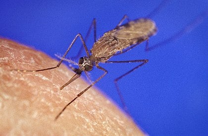

# Bài toán 12: Không có gió - lá cờ bay vẫn bay!

“Mấy ngày liền trời không có gió. Theo dự báo thời tiết, tình hình này còn kéo dài. Trong khi đó, kịch bản phim viết: ‘Ngọn cờ tung bay phần phật trước gió’. Đạo diễn phim mong muốn giải vấn đề nói trên với điều kiện trong vòng 100 mét xung quanh cột cờ không được để bất kỳ vật lạ nào”.(Sưu tầm)

  

 
# Bài toán 13: Tập luyện cùng nhà vô địch!

Hãy tưởng tượng rằng bạn là một vận động viên và bạn cần phá kỷ lục thế giới về chạy đường dài. Tất nhiên, bạn tập luyện trong nhiều giờ, bạn cố gắng hết sức mình và kết quả của bạn vẫn không đạt được chức vô địch. Về lý thuyết, thật là tốt nếu một nhà vô địch thực thụ chạy cùng bạn dọc theo đường đua và bạn sẽ cố gắng vượt qua anh ta. Giống như trong các cuộc thi, khi bạn nhìn thấy một đối thủ và cố gắng vượt qua đối thủ, kết quả  tốc độ của bạn ngày càng được cải thiện. Nhưng bạn kiếm một nhà vô địch ở đâu để cạnh tranh trong quá trình huấn luyện?

 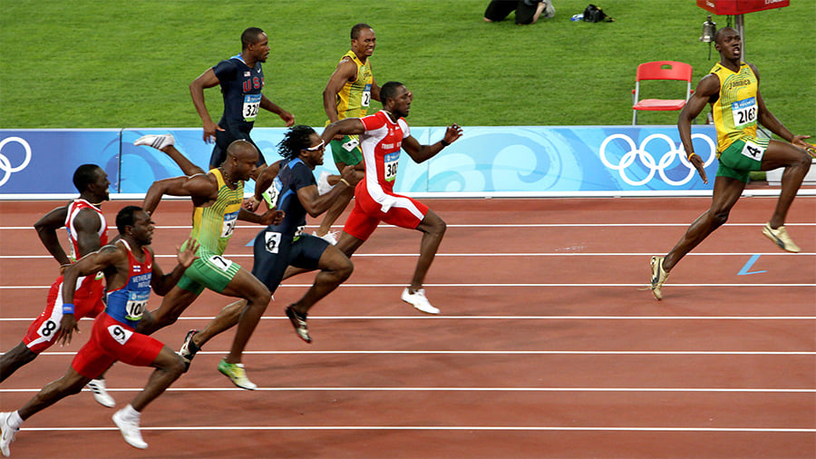

# Bài toán 14: Chuyến thám hiểm Nam Cực!

Vào những năm đầu thế kỷ 20, nhà thám hiểm Roald Amundsen (7/1872 – 6/1928), quyết định đặt chân đến vùng đất Cực Nam bán cầu (Nam  cực). Trở ngại chính để đến Cực Nam, ngoài nhiệt độ thấp và sự không chắc chắn về địa lý, còn là việc thiếu kinh phí. Vào cuối những thế kỷ trước - đầu những thế kỷ hiện nay, do động cơ, máy móc không đáng tin cậy, người ta chỉ còn dựa vào lực kéo của động vật (loài chó) và con người. Nhưng động vật, giống như con người, phải ăn. Lượng thức ăn cho những động vật kéo xe trượt tuyết và cho người vượt quá khả sức của những con vật. Điều này buộc phải thêm xe phụ để kéo thức ăn nên cần thêm động vật phụ và do đó tiêu thụ thêm thức ăn. Nó thành ra một vòng luẩn quẩn. Hỏi ông phải làm gì để ông đặt chân lên Nam cực với sự giúp sức của loài chó?
 
  

 
# Bài toán 15: Nước đá không phải chỉ để giải khát!

Vào một ngày đẹp trời ở Baku, Azerbaijan, một cậu bé học sinh lớp 4 đang trở về từ trường, cậu nhìn thấy một số thợ sửa chữa, buồn bã đang đam chiêu hút thuốc cạnh trạm biến áp. Họ đang đứng nhìn chiếc máy biến áp to tướng, nặng cồng kềnh đặt trên chân đế betong cao hơn 1 met. Họ đang chờ đợi chiếc xe cần cẩu đến để hạ cái vật nặng hàng tấn này xuống để lắp đặt cái mới. Cả thành phố sẽ chìm trong bóng tối vì xe cần cẩu cuối tuần mới tới nơi. Một viên kế toán ngồi trên xe ngựa và chở đầy nước đá phía sau. Hỏi viên kế toán đã làm như thế nào để hạ xuống chiếc máy biến áp hỏng?. 

Đây là lần đầu tiên câu bé Genrich Altshuller chứng kiến một nhà sáng chế, đánh dấu bước ngoặc trong cuộc đời của Genrich Altshuller – người khai sinh ra phương pháp luận sáng tạo Triz. 
Happy Birthday Genrich Altshuller! 15 – 10 – 1926.
 
  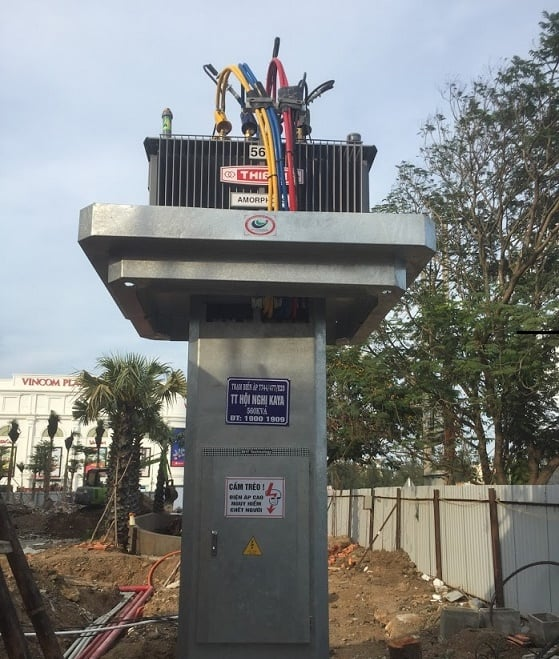

 
# Bài toán 16: Thử thách hiền tài!

Tương truyền rằng, sau khi chọn xong vị trí để xây dựng kinh đô, nhà Vua đưa ra thử thách để chọn “hiền tài” hiến kế xây dựng kinh thành. Nhà Vua muốn xây dựng một bức tường thành đáp ứng những điều kiện sau:

* Chiều dài của tường thành phải: dài để bảo vệ được nhiều diện tích nhất có thể, và phải ngắn để giảm chi phí xây dựng.

* Chiều cao của tường thành: phải cao lớn để quan sát quân địch bảo vệ thành phố và phải thấp để ít vật liệu tốn hơn.

* Bề dày của tường thành: phải lớn để nó vững chắc và phải nhỏ để không ảnh hưởng diện tích sử dụng.

 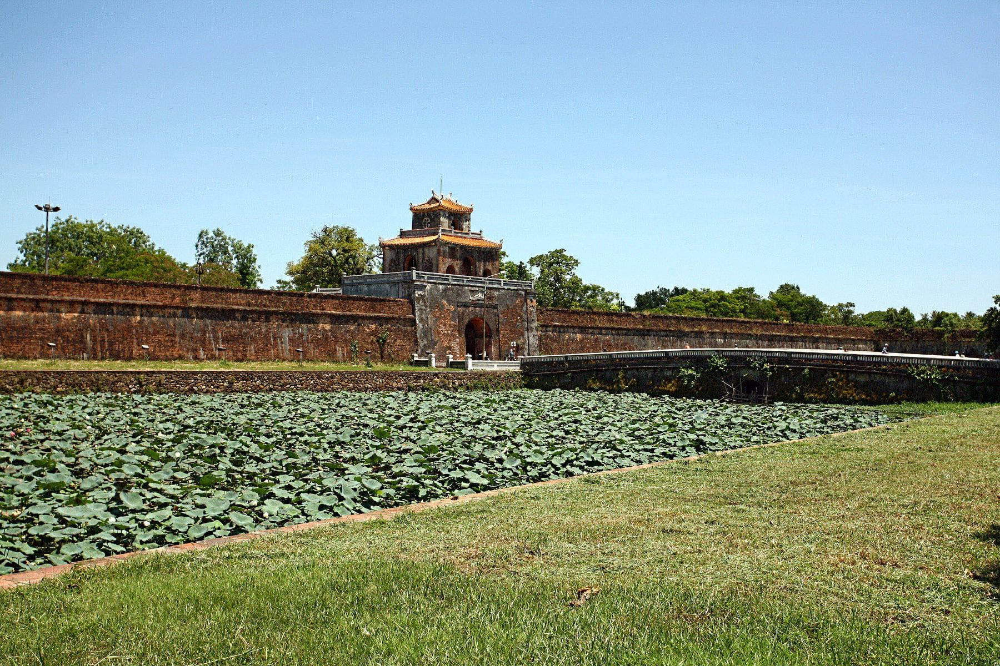

Hỏi bức tường thành phải có hình dạng như thế nào?
 
# Bài toán 17: Ước gì tôi có 10 cái tay!

Người thủ thư nhìn đống sách trên kệ trầm ngâm và đầy ngán ngẩm “lại phải chuyển phòng nữa rồi!”. Cứ mỗi lần chuyển phòng, cô thủ thư “già” như phải trải qua một tháng mất ăn, mất ngủ. Cô phải sắp xếp sách vào thùng một cách cẩn thận (theo thứ tự), đóng gói, thuê xe và nhân công chuyển sang nhà mới và rồi tự mình để cả đống sách lên kệ.

“Ước gì mình có 10 cái tay!”, cô thủ thư nghĩ thầm trong bụng. “Tôi không có kinh phí để thuê nhiều người vào làm phụ”.

 

Hỏi phải làm gì để giúp đỡ cô thủ thư?
 
# Bài toán 18: Hãy nhanh lên!

Một trang trại lớn của chủ điền có một chuồng bò lớn mới được xây dựng. Không khí trong chuồng bò phải luôn được làm mát, sạch sẽ, tươi mới. 

- Chủ điền gọi cho các nhà khoa học và nói: Tôi muốn biết hệ thống lưu chuyển gió, không khí trong chuồng có tốt không?. Hãy đo đạc và tìm hiểu.

- Các nhà khoa học nói: Chuồng bò rộng, trần nhà cao, tốc độ không khí tuỳ thuộc vào nhiệt độ của tường và mái. Sẽ phải đo nhiều vị trí từ nền đền trần nhà. Chúng tôi cần 2 tháng để hoàn thành công việc.  

- Ông chủ điền xua tay : À, anh biết đấy.  Có thể nhanh hơn được không? Tôi muốn biết hướng và tốc độ gió tại mỗi điểm trong chuồng bò ngay bay giờ.
Hãy giúp các nhà khoa học?

 

  
# Bài toán 19: Tấc đất tấc vàng!

Đây là bản đồ địa lý của Nga và các quốc gia khác, biên giới chung là một đường rất gấp khúc, uốn lượn. Thách thức đặt ra là xác định chính xác diện tích khu vực của mỗi quốc gia, mỗi địa hạt. Hãy nhớ phương pháp chúng ta đã học ở trường? chúng ta chia đất nước thành các ô vuông nhỏ trên bản đồ đường viền, tính diện tích mỗi ô vuông, sau đó đếm số ô vuông ... Và chúng ta nhận được một kết quả rất, rất không chính xác, bởi vì các ô vuông nhỏ đến đâu đi chăng nữa thì tổng diện tích vẫn lớn hơn hoặc ít hơn thực tế rất nhiều. 

 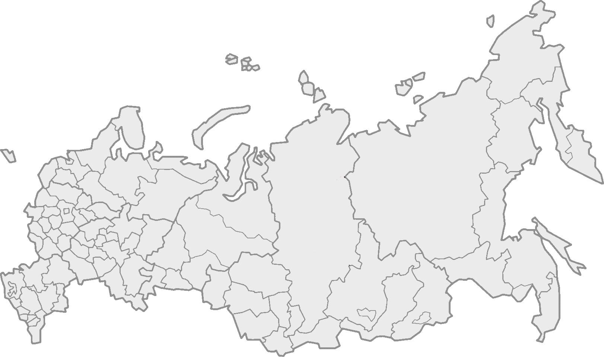

Vì vậy, chúng ta cần một cách khác để đo chính xác diện tích của mỗi quốc gia, diện tích vùng, địa phương, và diện tích của một vật có hình dạng bất kỳ. Hỏi phải làm sao?
 
# Bài toán 20: Hành Tinh nguy hiểm!

Một hành tinh rất kỳ lạ đã được mô tả trong một câu chuyện viễn tưởng. Mọi thứ trên hành tinh đó đều giống với Trái đất của chúng ta, ngoại trừ việc chim và côn trùng ở trên hành tinh này bay với tốc độ siêu thanh. Chúng ta không cần quan tâm tại sao chúng lại làm được điều này. Bản chất của câu chuyện là khi gặp phải những sinh vật như vậy thì rất nguy hiểm. Chúng có thể giết bạn như một viên đạn. Vì vậy, không khí tràn ngập “đạn bay” và “đạn pháo”. Hai nhà phi hành gia rời phi thuyền của họ và suýt thiệt mạng. 

 

Bạn có thể tưởng tượng là một thành viên của đoàn thám hiểm đến hành tinh đó. Hãy đề nghị các biện pháp an toàn cho các phi hành gia.

(G. Altov)

 
# Bài toán 21: Con quạ khát nước!

Vào một ngày nóng nực, một con quạ khát nước bay lượn trên cánh đồng để tìm nước uống. Nó đã bay một thời gian rất lâu nhưng không tìm thấy gì. Nó đang bị đuối sức và gần như tuyệt vọng.
Đột nhiên, quạ nhìn thấy một bình nước ở dưới đất. Nó liền bay thẳng xuống để xem cái bình có nước hay không. May thay, có nước trong bình!

Quạ cố gắng chúi đầu vào bình để uống nước. Nhưng thật không may, cổ chiếc bình quá nhỏ, quạ không thể chúi đầu vào được. Sau đó, quạ tìm cách đẩy ngã chiếc bình để nước chảy ra, nhưng chiếc bình quá nặng, quạ không thể đẩy được.

Quạ suy nghĩ một hồi lâu, và nó triền miên trong những ước muốn và mâu thuẫn:

 - nước trong bình tự dâng lên tới ngang miệng bình để mình khỏi phải cúi đầu vào!
 
- cái miệng mình có thể  dài ra như con cò hay con chim ruồi mỏ kiến thì mới hút được!

- mình có sức mạnh của con sói để có thể đạp vở cái bình!

- nước có thể bay lên như mình, không nằm ì dưới đáy bình thì mình có thể tóm được!

- Hay thôi, bay đi chổ khác có nước dễ uống hơn?

Con quạ phải làm gì cho những điều ước của mình? Con quạ làm gì để được nước uống?
 
  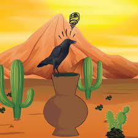

 
(PS: Đây là một trải nghiệm đối với học sinh mầm non và tiểu học tại trường mầm non Mầm non Tư Duy Sáng Tạo TRIZ -Trizer Kindergarten . Những phương pháp phát triển tư duy sáng tạo - tưởng tượng (RTV -Triz) sẽ cho trẻ một hành trang tuyệt vời bước vào thế kỷ 21. Cám ơn Thầy Linh Nguyen đã có những chia sẻ vô cùng quí giá)

# Bài toán 22: Không thể làm trái lệnh vua!

Hải đăng Alexandria là một hải đăng được xây dựng trong triều đại của Ptolemy II Philadelphos (280 – 247 BC), là một trong 7 kỳ quan của thế giới cổ đại, một trong những cấu trúc nhân tạo cao nhất trên thế giới (100m).

Với một công trình kiến trúc khổng lồ, một tượng đài được xây dựng bởi một thiên tài: Kiến trúc sư hay Hoàng đế?. Ai cũng muốn tên tuổi của mình bất tử cùng với công trình – khắc ghi tên mình bên cạnh công trình.

Kiến trúc sư buộc phải ghi tên Hoàng đế Ptolemy, nếu không thì mạng sống khó bảo toàn và anh cũng muốn thế hệ mai sau không quên rằng công trình này là của mình.

 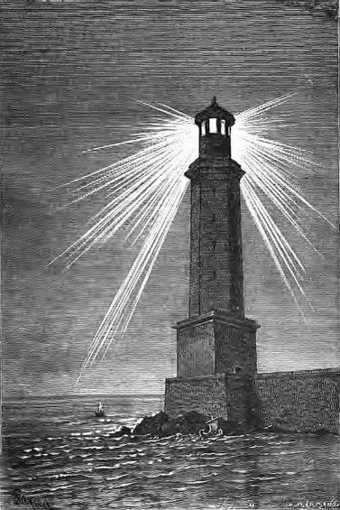

Hỏi Kiến trúc sư đã làm như thế nào để lưu lại tên tuổi của mình cùng với kỳ quan này? 
 
# Bài toán 23: Robinson trên đảo hoang!

Để rời khỏi hòn đảo hoang của mình, Robinson Crusoe đã chặt một cái cây khổng lồ trong suốt một tháng. Phải mất vài tháng để làm một chiếc thuyền bằng thân cây này. Robinson luôn cố gắng không nghĩ về cách anh ta sẽ đưa chiếc thuyền này xuống nước. Khi con thuyền đã sẵn sàng, nó trở nên to lớn, nặng nề, đáng tin cậy và sẵn sàng ra khơi; Và sau đó anh ấy không thể bỏ ý nghĩ làm thế nào để đưa con thuyền xuống nước. Những nỗ lực để di chuyển con thuyền đã được chứng minh là không có kết quả. Robinson cố gắng hành động “ngược lại” - để dẫn nước đến gần con thuyền. Nhưng khi tính toán khối lượng công việc phải làm, anh ấy đã từ bỏ ý định này. 

 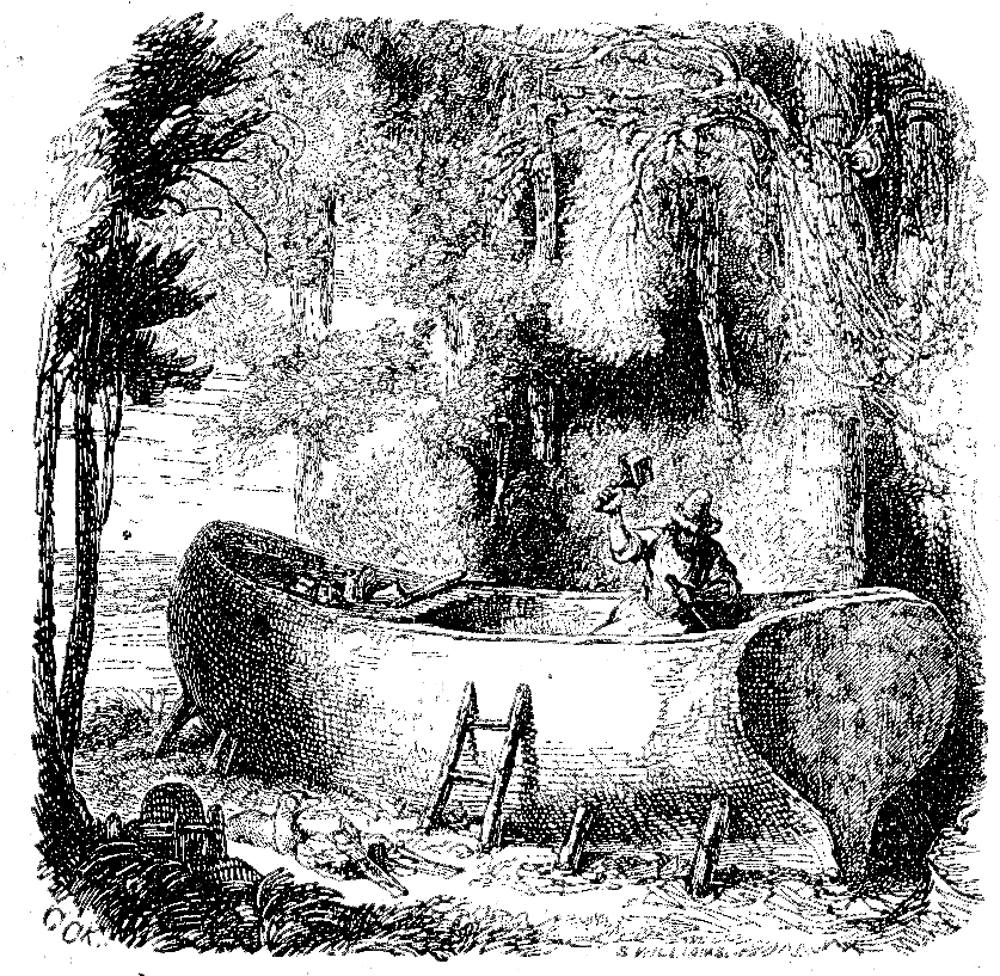

Robinson phải làm gì trong tình huống này?
 
# Bài toán 24: Thỏ Rex quí hiếm !

Vào những năm 1920, ở Đức, một giống thỏ Rex với bộ lông sang trọng rất quý giá – quý hiếm đã được lai tạo. Việc xuất khẩu giống thỏ này ra khỏi biên giới đã bị nghiêm cấm. Nhưng chính trong những năm đó, nhà sinh vật học A.S. Serebrovsky đã có mặt ở Berlin trong một chuyến tham quan khoa học. Khi trở về nước, ông nhân giống thành công giống thỏ  Rex "bí mật" này. Ông đã  lấy vật liệu di truyền quý giá, dưới sự giám sát chặt chẽ của các nhân viên hải quan Đức và không vi phạm pháp luật! 
Làm thế nào ông ấy đưa giống thỏ Rex ra khỏi nước Đức?

  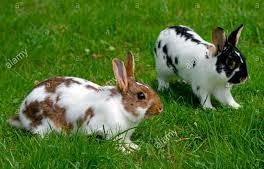

 
# Bài toán 25: Loài cáo vùng Alaska !

 Trong quá trình quay bộ phim của V. Peskov về đời sống động vật ở Alaska, các nhân viên của đoàn làm phim Mỹ đã rất ấn tượng khi chứng kiến 5 chú cáo con vô cùng dễ thương và đáng yêu. Tuy nhiên, loài cáo là loài động vật rất nhút nhát và để quay đời sống hàng ngày của chúng dường như là không thể . Những con cáo nhỏ đã không để con người đến gần chúng. 
 
  

 
Làm thế nào đoàn làm phim có thể ghi hình những con cáo ở khoảng cách gần?
 
# Bài toán 26: Thuyền độc mộc !

Ở các bộ tộc Châu Phi, người dân di chuyển trên sông, hồ  bằng thuyền độc mộc. Chúng thường hẹp về chiều ngang do kích thước thân cây và cũng để giảm sức cản của nước khi di chuyển. Bạn có thể hình dung khi họ đi bắt cá: “thuyền không rộng nếu một người thợ săn cố gắng đâm một ngọn giáo vào một con cá, thuyền mất cân bằng và bị lật, tất cả thành quả đã đánh bắt được chìm xuống dưới nước. Bạn nên làm gì khi đi bắt cá trên chiếc thuyền này?

  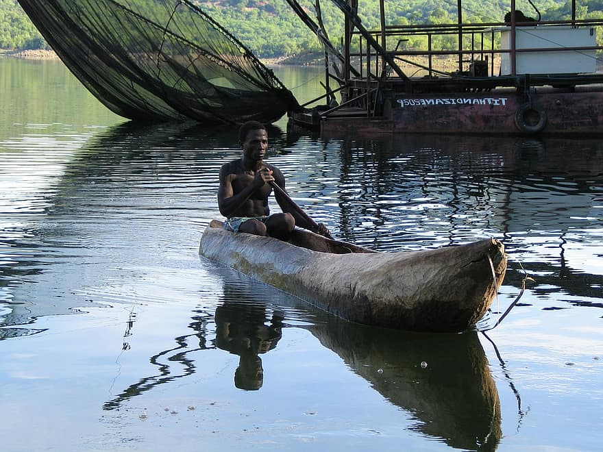

# Bài toán 27: Tấm kính oval!

Một nhà máy được đặt hàng làm rất nhiều tấm kính có hình dạng oval và chỉ dày 1mm. Cách họ chế tạo: đầu tiên cắt những tấm kính hình chữ nhật, sau đó bo (mài) các góc để tạo hình oval cần đạt. Tuy nhiên các tấm kính quá mỏng nên có rất nhiều tấm kính bị vỡ. Người công nhân chỉ bo được các tấm kính dày hơn, tuy nhiên tấm kính được đặt hàng chỉ dày được tối đa 1mm thôi.
Bạn có cách nào giúp người công nhân hoàn thành công việc không?

  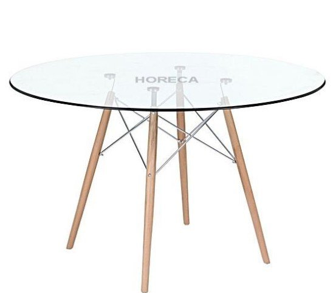

# Bài toán 28: Thanh thuỷ tinh mỏng manh!

Khi điện thoại reo trong nhà Emil, dì của Emil cầu anh mang gấp cho cô những thanh thủy tinh dài mỏng, mà cô đã để lại trong chuyến thăm lần trước. Emil luôn sẵn lòng giúp đỡ người dì thân yêu của mình. Nhưng có một vấn đề: những thanh này dài và mảnh, bất kể bạn đặt chúng ở đâu, chúng sẽ bị gãy. Emil nên làm gì?

 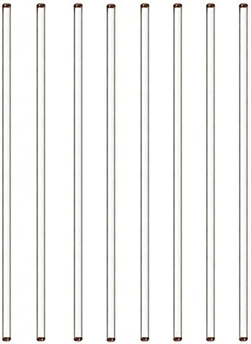

# Bài toán 29: Xiếc sư tử!

Một trong những màn biểu diễn hấp dẫn nhất được những nghệ sĩ xiếc sư tử thể hiện là khi một con sư tử há to miệng và người nghệ sĩ đặt đầu mình vào bên trong. 

Màn biểu diễn này rất nguy hiểm vì ngay cả con sư tử ngoan ngoãn nhất vẫn là con thú săn mồi, bất kể nó đã được thuần hóa tốt như thế nào! 

Làm thế nào để những người nghệ sĩ thực hiện màn biễu diễn này?
 
  

 
# Bài toán 30: Chuyện gì đã xảy ra?

Bưu điện tiếp nhận bưu kiện, có ghi chú khối lượng 8kg, và giá trị của nó rất cao. Khi tới nơi, khối lượng của bưu kiện giảm đi nhiều. Khách hàng yêu cầu bồi thường thiệt hại. Bề ngoài của bưu kiện vẫn như lúc đầu, ngoài trừ khối lượng nhẹ đi.
Chuyện gì đã xảy ra với bưu kiện?

  

 
# Bài toán 31: Cái hang này cao bao nhiêu mét?

Một đoàn thám hiểm khi vào hang động bị choáng ngợt bởi vẽ đẹp hoang sơ và hùng vĩ. Một thành viên lên tiếng: “ Hang động này cao bao nhiêu mét? Chắc khoảng trên trăm mét?.”

Những người thám hiểm hang động, những người leo núi không chuyên thường không có các thiết bị chuyên dụng phức tạp, đắt tiền.

Bạn có gợi ý gì cho thành viên của đoàn này không? phương pháp đo cần đơn giản, dễ thực hiện.

  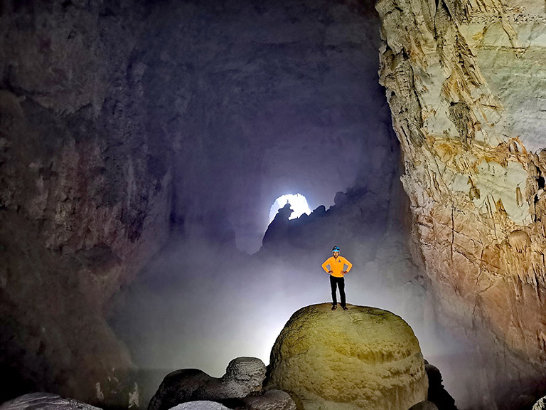

# Bài toán 32: Ngôi sao trên nóc toà nhà.

Ông chủ khách sạn đến công trường để nghiệm thu công trình. Mọi người đều trầm trồ về vẻ đẹp lộng lẫy của nó. Sau khi ông chủ quan sát một vòng thì quay lại bảo với các kỹ sư: “Các anh đã làm rất tốt, bây giờ tôi muốn một ngôi sao lớn ở trên nóc toà nhà, để mọi người ở rất xa cũng có thể thấy được địa điểm này mà ghé lại”.

Một kỹ sư lớn tuổi lên tiếng: “Một ngôi sao lớn ở trên cao, ở đây gió rất mạnh. Nếu để ngôi sao ở trên kia thì cần hệ thống chằng chống rất phức tạp. Và quá nguy hiểm cho mọi người ở phía dưới nếu hệ thống này ngã xuống.”

Ông chủ khách sạn quả quyết: “Các anh phải làm bằng được cho tôi hoặc không có tiền nong gì ở đây cả!”.
Các bạn có ý kiến gì giúp các anh kỹ sư này không?

  

# Bài toán 33: Con mèo và đàn chim nhỏ.

Nhìn thấy đàn chim đang ăn những hạt thóc bác trai vô cùng thoải mái và thích thú. Đột nhiên, bác trai giật mình khi thấy mèo con đang rình đàn chim, con mèo hoang mà bác gái mang về từ hôm qua. 
Phải làm sao bây giờ, đàn chim con chưa biết bay ở trên tổ? Chim bố và chim mẹ còn biết bay để thoát thân, chứ con mèo mà trèo lên cây là xác định luôn số phận chim con!
Bạn có cách nào để con mèo không tổn thương chim con trên tổ không?

  

# Bài toán 34: Chú ong mật bị bệnh.

Ong mật trưởng thành thường mắc các loại bệnh do virut gây ra. Ngoài ra còn một số bệnh do vi khuẩn… Bệnh do ký sinh trùng varoa và nấm.

Ong mật thỉnh thoảng bị bệnh. Những con ong bị bệnh có thể được điều trị bằng các loại thuốc bôi lên cơ thể chúng. Tuy nhiên, bắt từng con một và bôi thuốc lên cơ thể từng con thì lâu và vô cùng tốn kém. Chúng ta không thể phun thuốc tổ ong từ bên trong, vì điều này làm giảm chất lượng mật, điều này là không thể chấp nhận được.

Làm sao để chữa bệnh cho từng con ong?
 
  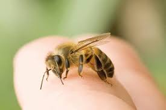

 
# Bài toán 35: Hãy giữ phẩm giá cho vua Francis I.

Sau trận đánh tại Pavia năm 1525, vua  Francis I của Pháp bị bắt bởi đế quốc Tây Ban Nha. Họ muốn chế nhạo vị vua bại trận: để ông ta vào sảnh cung điện mà không đội mũ lưỡi trai và cúi chào họ. Nhưng nhà vua không chịu chấp nhận sự sỉ nhục này. Sau đó, họ ra lệnh cho các thợ thủ công đóng một tấm ván ở giữa ô cửa. Bây giờ nhà vua sẽ không thể vào hội trường nếu không cúi xuống. Vua phải làm gì để không bị mất phẩm giá?

  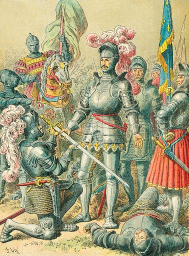

# Bài toán 36: Vàng được cất giấu ở đâu?.

Tên cướp biển R. Surcouf, người Pháp thế kỷ 17, cuối cùng đã bị bắt và đưa ra trước tòa án hoàng gia. Tuy nhiên, trước những câu hỏi của điều tra viên: "Các anh giấu kho báu ở đâu?" 
- Câu trả lời “bướng bỉnh”: :Chúng tôi luôn mang theo bên mình”. 
Trên con tàu "Furd" của anh ta, các điều tra viên đã tìm kiếm, nhưng chỉ tìm thấy những mảnh vụn vàng và đá quý khốn khổ. Và chỉ khi đưa tên cướp biển lên tàu, điều tra viên mới biết rằng tên cướp biển đã không nói dối. 
Hỏi vàng được giấu như thế nào mà điều tra viên không thể tìm thấy?

 

# Bài toán 37: Nhện là bạn, không phải kẻ thù!.

Nhện thường xuyên bắt sâu bọ có hại và côn trùng mang mầm bệnh như muỗi. Một số loài nhện mang lại cho người nông dân rắc rối. Nhện giăng tơ sống trên đồng cỏ,  dệt những tấm lưới khổng lồ để săn bắt, nên đôi khi nó tiêu diệt nhiều con ong. Người nuôi ong rất thích ong, nhưng nhện cũng có ích, nên người nông dân không muốn giết loài nhện. Người nuôi ong phải làm gì?

  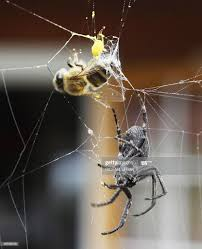

# Bài toán 38: Phong tục cưới hỏi ở Delhi!.

Mỗi quốc gia có truyền thống đám cưới của riêng mình. Ở  Delhi - Ấn Độ cũng có phong tục riêng của mình. Chú rể trong trang phục dân tộc cúi lạy cha mẹ để đi đón vợ và ngồi trên lưng ngựa. Trên lưng ngựa, chú rể phải đến nhà cô dâu. Nhưng phi nước đại qua thành phố có thể lãng mạn, nhưng lại quá dài và rắc rối trong điều kiện giao thông của Delhi. Làm thế nào để chú rể giữ được truyền thống?

  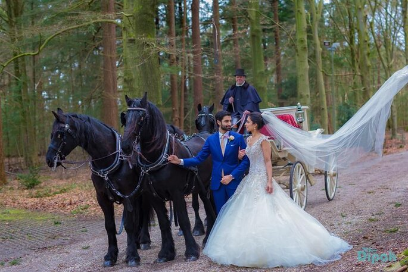

# Bài toán 39: Gấu “Bắc Cực” liệu có thích màu trắng!.

Thiên nhiên đã “ban tặng” những chú gấu Bắc Cực bộ lông trắng muốt. Một mặt, điều này là tốt: nó cho phép bạn ngụy trang trong băng và tuyết. Mặt khác, nó rất bất tiện: ở các vùng cực, mặt trời hầu như không ấm lên. Để tận dụng tốt hơn lượng nhiệt mặt trời ít ỏi, con gấu vẫn phải có một làn da đen để hấp thụ các tia nắng mặt trời. Gấu bắc cực tồn tại như thế nào với bộ lông của mình?

  

# Bài toán 40: Cậu bé Bedouin vừa chào đời!.

Người Bedouin là những bộ lạc Ả Rập du mục đã từng sinh sống trên các cùng sa mạc ở Bán đảo Ả Rập, BẮc Phi, Levant và Méopotamia. Họ chăn nuôi lạc đà và dê. Sự ra đời của một cậu con trai đối với người Bedouin là một trọng đại. Để tôn vinh sự kiện này, họ giết mổ một con cừu và tổ chức một bữa tiệc. Tuy nhiên, nếu lúc đó cha của đứa trẻ đi vắng, thì không có ai giết cừu - đây là việc chỉ dành cho nam giới, phụ nữ không có quyền làm việc này. Yêu cầu sự giúp đỡ từ những người đàn ông khác cũng không đúng với phong tục. Làm thế nào để giết một con cừu?

  

# Bài toán 41: Người thợ săn điếc!.

Kararbakh, một thợ săn kinh nghiệm nhưng bị điếc. Và không có người thợ săn nào giỏi hơn trong gia đình anh, không ai biết rừng Taiga như anh. Trước đây, Kararbakh đã đến rừng Taiga, đi bộ dọc theo những con đường mà anh biết đến một mình và luôn mang về chiến lợi phẩm dồi dào. Làm thế nào để săn bây giờ? Rốt cuộc, anh ta không nghe thấy tiếng sủa của một con chó đang đuổi theo con mồi. Bạn có thể dẫn theo một người đồng hành, nhưng Kararbakh luôn đi săn một mình và không muốn thay đổi thói quen của mình. Làm sao để? Người thợ săn Kararbakh phải làm gì để đuổi theo con mồi?

  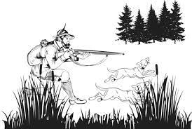

# Bài toán 42: Đoàn tàu không thể chờ thêm nữa!

Những khúc gỗ thông được chất lên toa tàu lộ thiên. Để xác định khối lượng gỗ chất lên, các thanh tra đã đo đường kính của từng thân cây. Công việc tốn nhiều công sức và chậm chạp. 

"Chúng ta sẽ phải giữ chuyến xe lửa lại", viên thanh tra trưởng nói.

 " Chúng ta cần 300- 500 người để đo".
 
Bạn có cách nào đo thể tích của tất cả các khối gỗ trên toa không? nếu xe lửa chạy trong 5 phút nữa? Hãy nêu cách đo nhanh thể tích của cả khối gỗ mà không làm trễ chuyến tàu?
 
  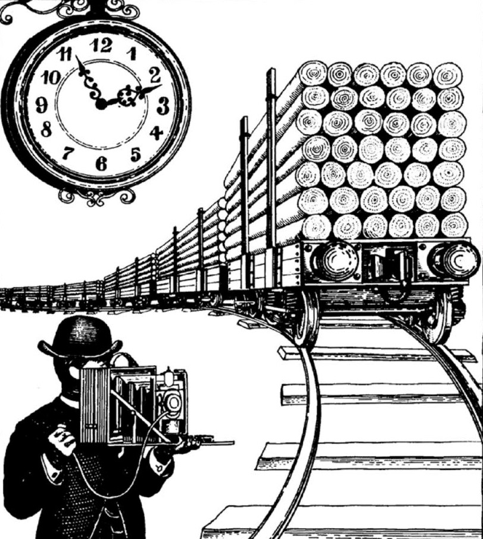

 
# Bài toán 43: Chú gấu nặng mấy kilogram?

Các nhà động vật học Mỹ, để đo và cân một con gấu xám ngoài đồng thì phải bắn nó bằng một ống tiêm thuốc ngủ. Nhưng bằng mắt thường rất khó xác định liều lượng thuốc ngủ cho một con vật to lớn như vậy: nếu nhiều thuốc ngủ - con gấu có thể chết, nếu ít quá - nó sẽ tỉnh lại và tấn công con người. Làm thế nào để các nhà động vật học biết được cân nặng của chú gấu?

  

# Bài toán 44: cuộc chiến với chim bồ câu.

Hầu như tất cả các thành phố đều có tượng đài những người nổi tiếng. Ở hầu hết các thành phố, nhiều chim bồ câu sống trên đường phố. Ở hầu hết các thành phố, chim bồ câu để lại phân của chúng trên các di tích, rõ ràng, mặc dù trong vô thức, họ coi thường trí nhớ của những người nổi tiếng này. Một trường hợp ngoại lệ là tượng đài Churchill ở Quảng trường Quốc hội, London, có kích thước bằng người thật của một người đàn ông thừa cân, chống gậy trong áo khoác ngoài và không đội mũ. Chim bồ câu không bao giờ ngồi trên đó. Làm thế nào những người tạo ra tượng đài đạt được điều này?

 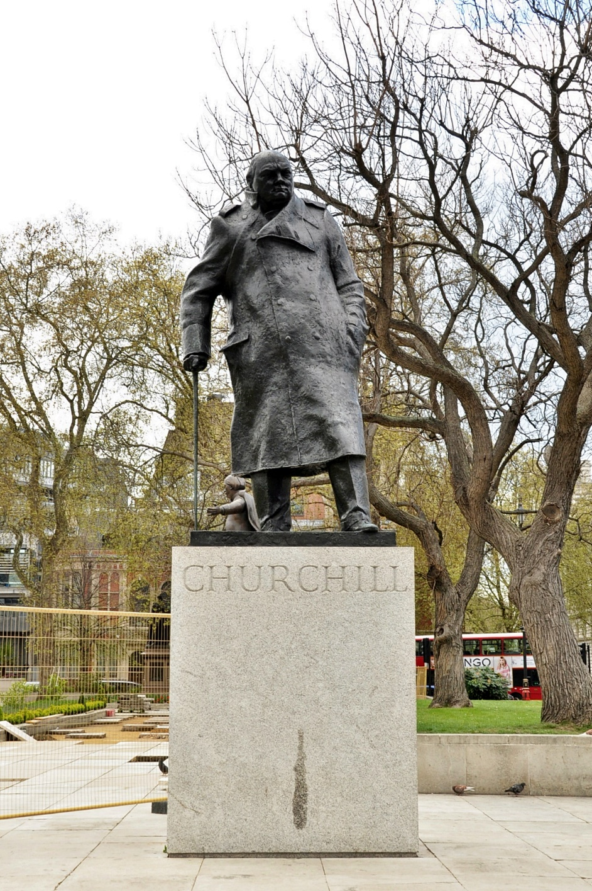

# Bài toán 45: Tiếng trống liên hồi.

Vào đầu thế kỷ XIII. Ở miền bắc Trung Quốc, quân đội của nhà Tống dưới sự chỉ huy của tướng Bi Zaiyu chống lại sự xâm chiếm quân đội của quân Nguyên. Quân địch đông hơn rất nhiều nên tướng Bi Zaiyu quyết định rút lui. Để ngăn người Mông Cổ nhận ra điều này, Tướng quân đã ra lệnh rời khỏi trại nhưng những lá cờ luôn bay phấp phới và tiếng trống vang lên liên hồi. Khi người Mông Cổ vào trại một ngày sau đó, không một bóng người ở đó, và tiếng trống vẫn tiếp tục vang lên. Vị tướng quân đã sắp xếp chuyện này như thế nào?

 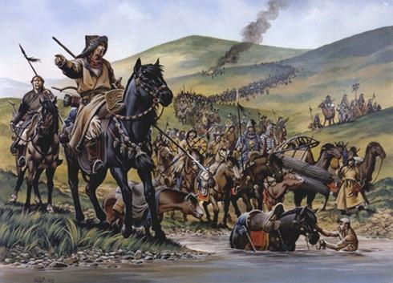

# Bài toán 46:Vua điếc.

Năm 1819, Vua João VI của Vương quốc Bồ Đào Nha, Brazil và Algarves cảm thấy rằng ông bắt đầu mất thính giác. Với quan hệ mật thiết với các cận thần, khuyết điểm này vẫn có thể được che giấu bằng cách nào đó. Nhưng trong các buổi chiêu đãi thường xuyên theo truyền thống, khi nhiều quí tộc, bá tước và vị khách của các vương quốc đối địch cùng tham gia trong một hội trường rộng rãi. Nếu người ngoài biết được tình hình của Vua João VI thì không có lợi cho vị vua uy nghiêm. Vua João VI đã xoay sở như thế nào để giải quyết vấn đề này?

 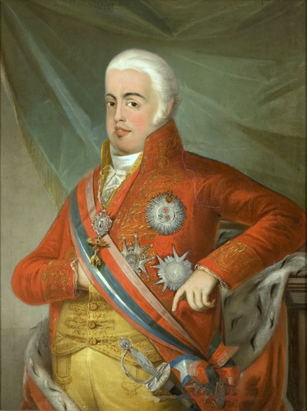

# Bài toán 47: Thanh kiếm Takoba.

Người Tuareg, một dân tộc du mục ở sa mạc Sahara, từ lâu đã coi sắt là một kim loại "không thuần khiết", vì họ lấy sắt từ hợp kim của các kim loại khác. Người Tuareg “trung thành” thậm chí không thể chạm tay vào sắt, nhưng những lính Tuareg luôn mang theo thanh kiếm bằng sắt để bảo vệ bộ lạc khỏi những vị khách không mời. Làm thế nào người lính Tuareg giải quyết mâu thuẫn này? Lưu ý không có cây nào trong sa mạc có thể tạo ra chuôi kiếm?

  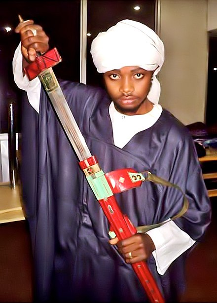

# Bài toán 48: Cầu cây.

Trong những khu rừng rậm phía đông bắc Ấn Độ, có những cây cầu dành cho người đi bộ bắc qua sông, đã mọc lên như thể một cách tự nhiên. Để tạo ra những cây cầu như vậy, người Ấn Độ  thường sử dụng loại dây leo mạnh mẽ từ rễ của cây sung cao su. Nhưng rễ cây này thường mọc ngẫu nhiên để tiềm kiếm dinh dưỡng. Làm thế nào người Ấn Độ  xây dựng cây cầu dài tới 30m trong rừng?

 

# Bài toán 49: Con ngựa trên mái nhà.
Năm 1853, sau một trận hỏa hoạn, việc khôi phục Nhà hát Bolshoi ở Mátxcơva bắt đầu. Trên đỉnh của portico, người ta quyết định thay thế tác phẩm điêu khắc bằng thạch cao của thần Apollo, bị phá huỷ trong đám cháy bằng điêu khắc một nhóm ngựa đang phi nước đại làm bằng đồng. Theo quan niệm của tác giả của tác phẩm điêu khắc, Peter Clodt von Jürgensburg, con ngựa nên “bay lượn” trên portico. Nhưng làm thế nào để đạt được điều này? Rốt cuộc, các tác phẩm điêu khắc rất lớn, điểm tựa cho chúng chỉ là chân sau của những con ngựa, và mái của tòa nhà không cho phép cố định các chân sau đủ sâu. Klodt đã giải quyết vấn đề này như thế nào?

 

# Bài toán 50: Voi chiến sang sông.

Năm 219 trước Công nguyên, trong Chiến tranh Punic lần thứ hai, Hannibal xâm lược Gaul. Dòng sông chặn đường. Hannibal có rất nhiều kỵ binh và rất nhiều voi chiến. Họ quyết định vượt sông bằng bè. Nhưng những chiếc bè đung đưa theo sóng. Những con voi đã cảm nhận được điều này và không bao giờ muốn lên bè. Tư lệnh Hannibal phải xoay sở như thế nào để giải quyết vấn đề này?

 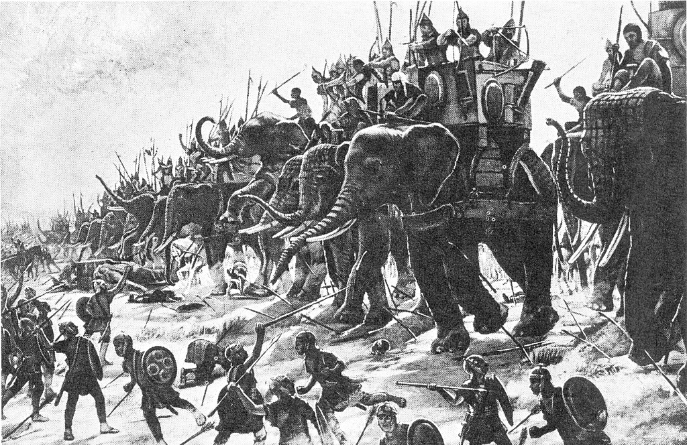

# Bài toán 51: Liệu ông Archimedes có liên quan?.

Đang lúc giảng bài định luật Archimedes – vật lý 8, thầy giáo hỏi: “Trong sản xuất ống thép, điều rất quan trọng là phải cắt bỏ một phôi có khối lượng chính xác từ một thỏi, khi đó tất cả các ống sẽ có chiều dài mong muốn. Và các thỏi có kích thước và hình dạng khác nhau. Họ lắp đặt rất nhiều cảm biến xác định hình dạng của thỏi, kích thước của nó, máy tính tính toán trọng lượng và chỉ ra nơi cần cắt. Nhưng hệ thống này hóa ra đắt tiền và phức tạp. Làm sao để cắt đúng một khối lượng mong muốn?”

 

# Bài toán 52: Lấy “vợ” hay lấy “gia tài”?.
Ngày xửa ngày xưa, có một phú ông vô cùng giàu có. Phú ông có một cô con gái xinh đẹp đến tuổi lấy chồng. Ông muốn một chàng rể ngoài trai tráng còn phải tài năng. Để dễ so bề với trạng nguyên Nguyễn Hiền ông ra câu đố như sau: “ một chiếc vỏ ốc xoắn hở 2 đầu, một sợi chỉ mảnh. Hỏi các chàng trai, ai có thể xâu chỉ qua vỏ ốc với nhiều hơn 1 cách?. Ngoài được làm rể của ta, ta sẽ tặng gia sản tương ứng với số đáp án khả thi, nếu có 2, 3… đáp án đúng thì ta sẽ nhường lại 2/10, 3/10… gia tài nhà ta”.

  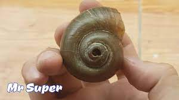

# Bài toán 53: “Hôn” gương.

Một phụ nữ quét dọn tại một trong những trường học phàn nàn với hiệu trưởng rằng chiếc gương trong phòng vệ sinh nữ có vết son hàng ngày. Lau sạch cái gương là một công việc đơn giản. Nhưng chỉ cần bà lau nó vào buổi tối thì hôm sau vết son lại xuất hiện.

Số là những nữ sinh mới lớn thỉnh thoảng lại trốn vào trong nhà vệ sinh để tô lại son môi và tự ngắm mình trong gương. Cứ sau mỗi lần như thế, không ít nữ sinh đã tự thưởng cho “người đối diện” trong chiếc gương soi ở phòng vệ sinh những nụ hôn nóng bỏng. 

Để khắc phục tình trạng này, hiệu trưởng đã tập hợp tất cả các nữ sinh trung học vào nhà vệ sinh và giải thích tận gốc lý do tại sao họ không nên hôn vào gương. 
Ông hiệu trưởng đã làm gì để những nữ sinh “tự từ chối” không chạm môi vào gương?

  

# Bài toán 54: Xin “tên” của địch.

Ở Trung Quốc, trong các cuộc chiến tranh phong kiến, quân nổi dậy đã bao vây quân của tướng quân Trương Tuần (709 - 757) trong pháo đài. Cuộc bao vây bắt đầu. Những người bị bao vây có nguồn cung cấp lương thực, nhưng không đủ mũi tên. Trương Tuần quyết định tận dụng những mũi tên của kẻ thù. Nhưng làm thế nào để quân nổi dậy "chia sẻ" mũi tên cho quân đội Trương Tuần, khi họ bị bao vây trong pháo đài?

  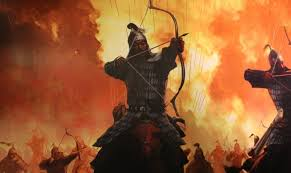

# Bài toán 55: Tăng – giảm hay không có gì xảy ra?.

Bạn đang ngồi trên một chiếc thuyền nổi trên mặt ao nhỏ. Có một cái túi ở trên thuyền. Bạn cảm thấy mệt mỏi khi phải "nâng" và ném cái túi ra khỏi thuyền. Điều gì sẽ xảy ra với mực nước trong ao? Mực nước tăng, giảm hay giữ nguyên – hãy giải thích? 

 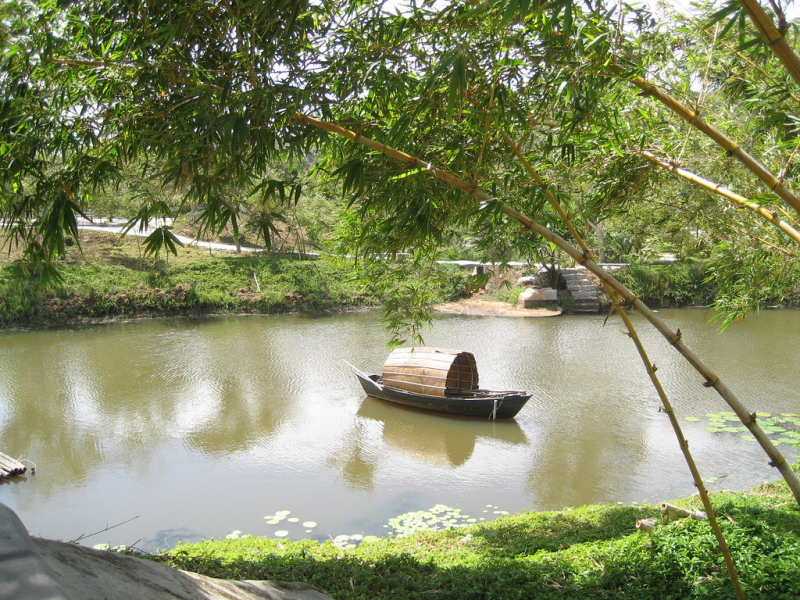

# Bài toán 56: Lâu đài gia đình Montaigne?

Vào thế kỷ XVI, đang diễn ra nội chiến ở Pháp, nạn cướp bóc xảy ra mọi nơi. Nhà triết học Michel de Montaigne có một lâu đài riêng. Những quí tộc cao quí đã trang bị vũ khí đầy đủ cho các nông dân của họ. Montaigne không có người hầu cũng như vũ khí. Theo bạn, ông đã làm gì để ngăn chặn lâu đài của mình bị cướp phá?

  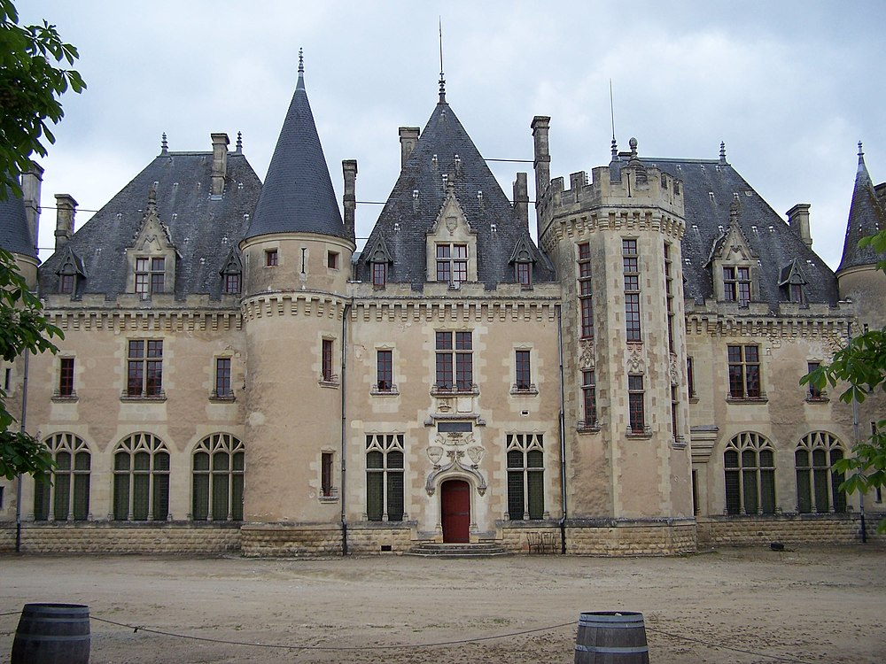

 
# Bài toán 57: Trực thăng không giúp được!

Các ống khói công nghiệp hiện đại đạt độ cao 200-300 m, thậm chí chúng ta đang thiết kế các ống khói cao hơn. Khi đường ống không hoạt động, nên đậy nắp bằng một số loại "nắp" để mưa và tuyết không lọt vào bên trong đường ống. Họ đã cố gắng bố trí những "nắp đậy" như vậy (đường kính 2-3 m), nhưng chúng đã bị gió giật tung, hoặc cơ chế đóng mở "nắp" hóa ra rất không đáng tin cậy. Nói chung, các cơ cấu lắp đặt trên “đỉnh” của đường ống sẽ nhanh hỏng do khí thải chứa các chất ăn mòn các vật liệu bền nhất. Tất nhiên là không dùng trực thăng bay lên để đậy nắp và tháo nắp. 
Hỏi cái “nắp” trong trường hợp này nên làm như thế nào?

  

# Bài toán 58: Chiếc điều hoà hoạt động như thế nào?

Khi trời nóng, một người bật điều hòa không khí hoặc cởi một số quần áo của mình ... Các loài chim không có điều hòa nhiệt độ. Làm thế nào để chim thoát khỏi cái nóng? Đề xuất những cách khả thi để các loài chim chống chọi với cái nóng?

  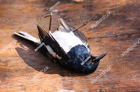

# Bài toán 59: Những chiếc giày “không còn” giá trị!

Giày thể thao Reebok rất phổ biến và thịnh hành trên toàn thế giới. Các nhà máy của công ty Mỹ ở Đài Loan và Thái Lan bị thiệt hại đáng kể bởi những tên trộm giày. Những đôi giày không chỉ bị đánh cắp từ các nhà máy, chúng còn được bán sang thị trường Mỹ với giá rẻ. Khả năng cạnh tranh của công ty đã giảm sút. Hỏi tập đoàn Reebok đã làm gì để những tên trộm không còn muốn đánh c

  

 
# Bài toán 60: No Graffiti!

Nghệ thuật đá ở các thành phố - graffiti - không nhận được nhiều tình cảm từ chính quyền địa phương, ngay cả những người dân chủ nhất. Nhưng có rất nhiều người muốn để lại dấu ấn của mình trên tường nhà, vòm cầu, hàng rào. Làm thế nào để các cơ quan chức năng có thể ngăn chặn những “loạn nghệ thuật” này?

 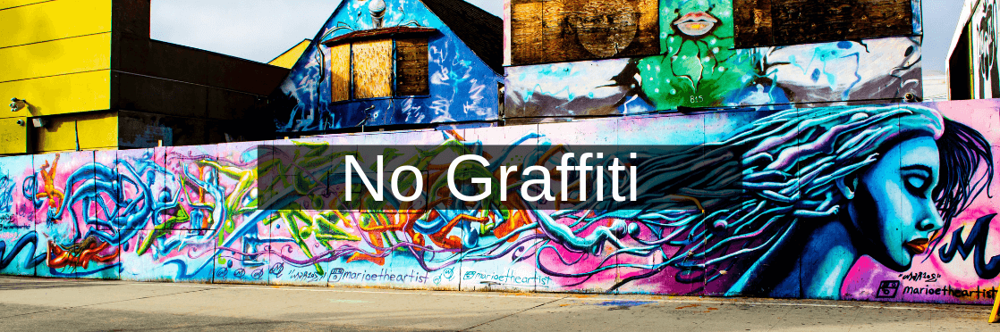

# Bài toán 61: Ống thuỷ tinh đựng thuốc!

Nhiều người trong đời ít nhất một lần  phải mở ống thuốc. Đây không phải là một công việc rất dễ chịu? Khi mở ống thủy tinh đựng thuốc, các mảnh thủy tinh có thể dính vào thuốc. Nó là không thể chấp nhận được. Làm sao mở ống thuốc an toàn?

 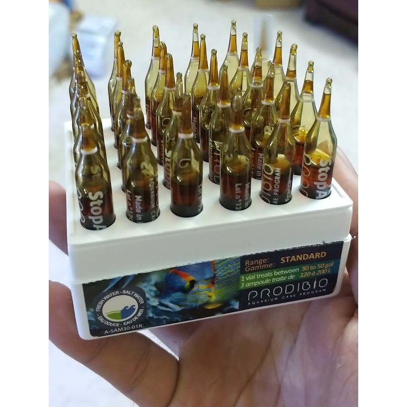

# Bài toán 62: Những vị khách không mời!

Hầu hết tất cả các cửa hàng – siêu thị đều gặp phải một vấn đề: khách hàng ăn cắp hàng hóa. Thiệt hại do trộm cắp không phải là nhỏ - lợi nhuận ngày càng giảm. Làm thế nào để thoát khỏi những tên trộm? Đưa ra một số đề xuất để giảm thiệt hại cho các cửa hàng – siêu thị do trộm cắp?

 

# Bài toán 63: Hung thần ở bên dưới!

Ở trong khu rừng rậm phía Nam Mỹ, chỉ có một hồ trong rừng. Và cá piranha săn mồi sống trong đó. Một người chỉ cần cúi xuống uống nước, cá piranha sẽ ngay lập tức "ngửi" thấy - và ngoạm lấy con mồi. Mặc dù rất sợ hãi, nhưng người ấy cũng muốn uống. Làm thế nào người đó có thể uống nước?

  

 
# Bài toán 64: “Điều ước” của chị lao công!

Bắn súng vào đĩa bay là một trong những môn thể thao. Nhưng các mảnh vỡ từ đĩa bay nằm rải rác trên một khu vực bãi cỏ rộng lớn, và rất khó để dọn dẹp và thu hồi mảnh vỡ. Ước gì các mảnh vỡ tự động biến mất? 

 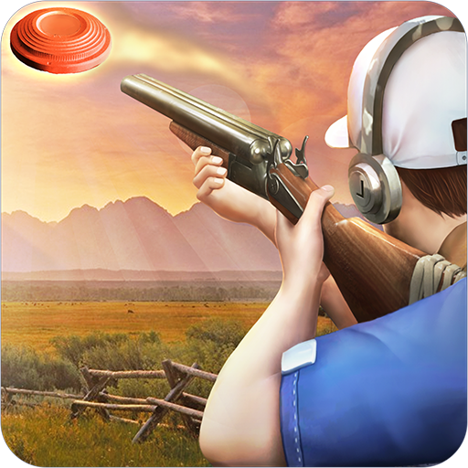

# Bài toán 65: Trò chơi “Slip N Fly”!

Cảm giác phấn khích sẽ giúp bạn đánh bại nỗi sợ hãi khi tham gia trò trượt nước “Slip N Fly”. Tuy nhiên, người chơi sẽ gặp rắc rối trong quá trình “va chạm” với mặt nước. Lý do là người chơi tiếp xúc mặt nước không đúng tư thế, hay là rơi từ độ cao quá lớn, và nước “quá cứng” hơn bình thường! Bạn có cách gì cho nước “mềm” đi không?

   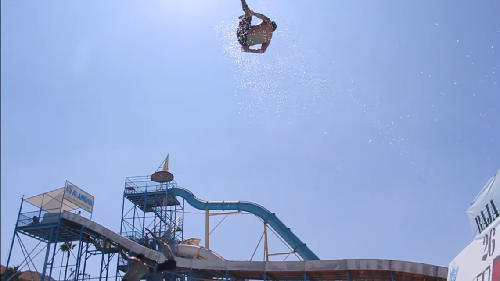

# Bài toán 66: Ngựa vằn hay uốn lượn con đường !

Cuối thế kỷ 19, một trong những quảng trường ở châu Âu đã được biến khuôn viên dành cho trẻ em, nhưng không thể ngăn chặn lưu lượng xe dọc theo con phố tiếp giáp với khuôn viên. Một vấn đề nảy sinh: làm thế nào để buộc tuyệt đối tất cả các tài xế phải vượt qua đoạn này với tốc độ thấp?

Hai ý tưởng đã được thảo luận: mang "ngựa vằn" cho người đi bộ trên toàn bộ đoạn đường. 

Hoặc làm cho đoạn đường này lượn sóng.

Giải pháp thứ nhất rẻ nhưng không hiệu quả, còn giải pháp thứ hai đắt nhưng đáng tin cậy. 

Đương nhiên, chính quyền muốn một giải pháp vừa rẻ và vừa hiệu quả từ hai ý tưởng trên. Còn đề xuất của bạn?

   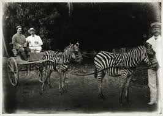

# Bài toán 67: “Tên” gì cho ngầu!

Ba người mở ba cửa hàng bán quần áo trên cùng một con phố. Chủ cửa hàng bên phải treo thông báo trước cửa nhà: “Chúng tôi có giá thấp nhất!”. Chủ cửa hàng bên trái treo tấm biển: “Hàng cao cấp nhất đây!”. Chủ cửa hàng “bình dân” nên treo slogan gì để thu hút khách hàng?

  

# Bài toán 68: Chiếc mũ xinh đẹp!  

Rạp chiếu phim tại Mỹ vào những năm đầu thế kỷ 20 rất náo nhiệt và đông đúc. Tuy nhiên, khán giả không hài lòng với việc trong suốt thời gian chiếu phim, các quý cô luôn đội mũ, che chắn màn hình. Và điều mà ban quản lý rạp chiếu phim đang phải đau đầu giải quyết. Họ đặt một quảng cáo – áp phích trong phòng chiếu phim, hành lang, phòng vệ sinh, yêu cầu “lịch sự” việc cởi mũ. Kết quả là con số 0, mọi việc vẫn vậy. Làm thế nào để khiến những quý cô bướng bỉnh phải cởi mũ trong một buổi chiếu phim?

  

# Bài toán 69: Phải “ngủ” và không “ngủ”!

Và năm 1950, chàng trai trẻ Genrich Altshuller (24 tuổi) bị bắt và giam ở nhà tù Lefortovo. Phòng giam rộng hai mươi mét vuông, hai giường dành cho 2 tù nhân. Một ngày tại địa ngục có thể tóm tắt như sau: thức dậy vào 6h30, bạn được làm những gì bạn muốn trong phòng, họ không cho phép bạn ngủ vào ban ngày, nên bạn không thể ngủ vào ban ngày và bạn không thể nằm xuống vào ban ngày. Đợi đến tối, 10 giờ, tắt đèn -  11 giờ rưỡi – mang bạn đi để thẩm vấn. Đến 5h sáng bạn được về phòng. Và bắt đầu ngày tiếp theo vào 6h30.

Không nghi ngờ gì nữa, chàng trai trẻ sẽ chẳng cầm cự được những ngày tiếp theo nếu không được ngủ.

Một tình huống sáng tạo nảy sinh. Chúng ta phải ngủ và không được ngủ!. 

Tôi phải ngủ vì tôi cần nó; Tôi phải thức vì lính canh yêu cầu.
Theo bạn, G.S Altshuller đã làm gì để sống với đầy đủ giấc ngủ suốt 25 năm trong tù?

 

Happy Birthday Genrich Altshuller! 15 – 10 – 1926

# Bài toán 70: Không được dùng “găng tay”!

Làm thế nào để cắt, ghép cây xương rồng mà không làm hỏng gai và không làm trầy xước tay của bạn? không găng tay, giẻ rách, không làm hỏng gai nhọn. Tất nhiên, bạn có thể cạo gai của nó! và mất đi giá trị cây xương rồng. 

Chúng ta phải làm gì để bảo vệ tay và không làm hỏng gai xương rồng?

 

# Bài toán 71: Oxi cho ao nuôi cá!

Nếu cho thêm không khí vào bể nuôi cá thì với một lượng nước không lớn, có thể nuôi được khá nhiều cá nhỏ. 

Vì vậy từ lâu người ta đã nảy ra ý nghĩ áp dụng biện pháp tương tự để tăng mật độ cá nuôi ở các ao, hồ… Tuy nhiên, biện pháp này tỏ ra không kinh tế: chỉ một ít không khí kịp hoà tan trong nước, còn phần lớn lại bốc hơi trở về khí quyển.

Đối với bể nuôi cá trong nhà điều này không đáng ngại - chỉ cần một motor nhỏ sẽ giải quyết được vấn đề. Nhưng ở các ao, hồ, quy mô hoàn toàn khác, xung quanh mỗi ao thả cá sẽ phải bố trí những máy nén khí công suất lớn, cộng thêm cả một hệ thống ống dẫn.

Bạn có cách nào khác để có thể cung cấp khí oxi cho cá, vừa kinh tế và hiệu quả không?

   

# Bài toán 72: Phẳng tuyệt đối!

Các chuyên gia cận đại đã rất ngạc nhiên khi phần đế của kim tự tháp rộng tới 4,5 ha - có bề mặt nằm ngang phẳng tuyệt đối. Làm thế nào người Ai Cập cổ đại, không có các công cụ chính xác hiện đại và các phương pháp san phẳng bề mặt, có thể làm tốt công việc này?

  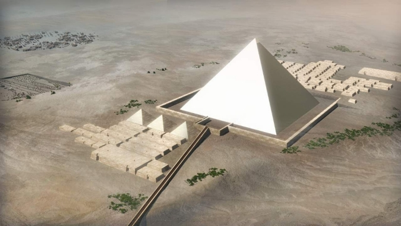

# Bài toán 73:Hàng rào “vô hình”
Một bức tường cách âm bằng plexiglass (vật liệu trong suốt) cao khoảng bốn mét đã được xây dựng dọc theo đường cao tốc gần Munich. Hóa ra những con chim, không để ý đến hàng rào "vô hình", thường xuyên đâm vào nó ... Vì vậy, ít nhất 760 con chim đã chết. Chúng ta nên làm gì để những con chim “tránh xa” bức tường?

 

 
# Bài toán 74: Sơn không phai!

Giám đốc một công ty đồ gỗ nói với nhân viên của ông ta: “ Trong năm ngoái chúng ta đã bán được hàng trăm bộ đồ gỗ cho các trường mẫu giáo. Thật không may khách hàng khiếu nại rằng những đứa trẻ đã làm tróc hoặc làm xước lớp sơn của đồ gỗ.” 
“Thật là tốt khi có bộ đồ gỗ sặc sơc trong nhà trẻ”
Chúng ta cần “loại sơn” nào đó có thể tồn tại mãi mãi không sợ trầy xước hay một cách khác?

 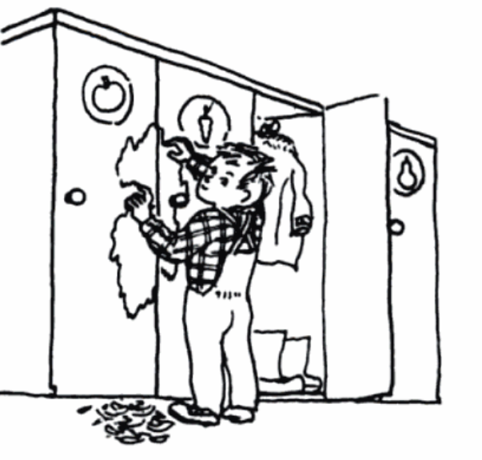

# Bài toán 75: Thách thức từ Edison

Edison thích đưa ra những vấn đề kỹ thuật "lắt léo" cho những người được tuyển dụng, đặc biệt là các nhà lý thuyết. Một lần ông mời nhà toán học Upton đến phòng thí nghiệm của mình và đề nghị ông khẩn trương tính thể tích của bóng đèn. Bạn có thể vượt qua kỳ thi Edison?
 
  

